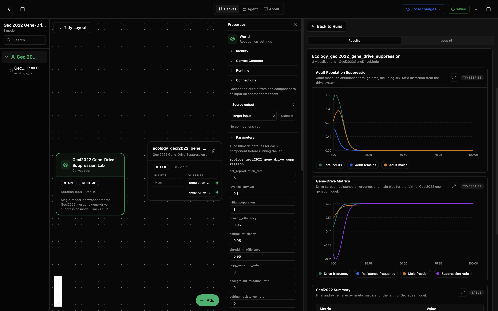
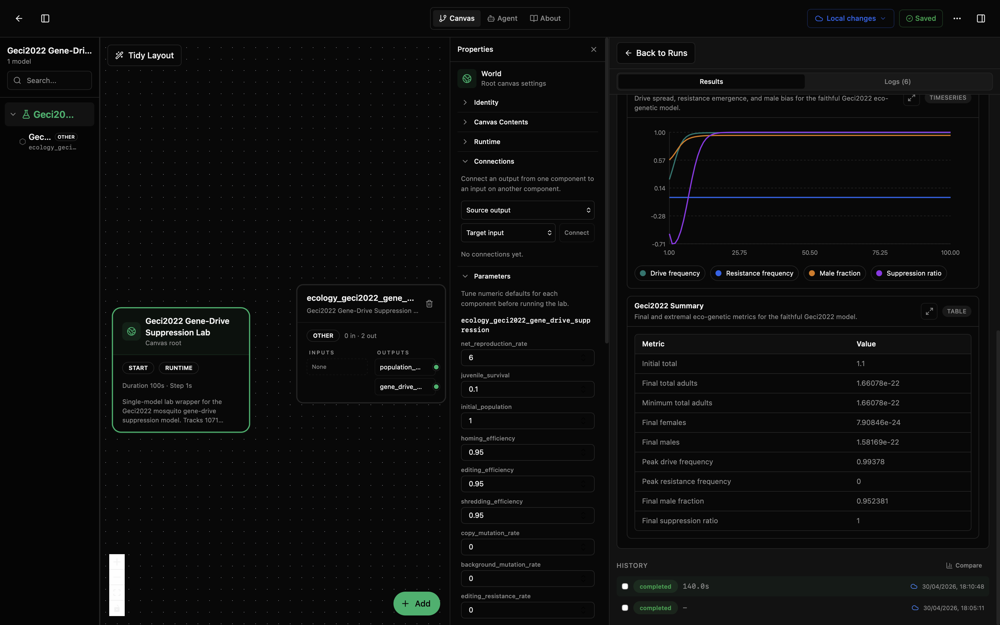

# Geci2022 Gene-Drive Suppression Lab

This lab runs a genotype-tracking gene-drive model for mosquito population suppression. It asks: if you release transgenic males carrying a Y-linked editor, an X-shredder, and an autosomal homing construct, what happens to the wild population over many generations?

The model tracks 1071 genotypes across three genetic components. Each generation, it applies mutation, homing, editing, recombination, gamete production with X-shredding, zygote formation, Beverton-Holt density-dependent survival, and genotype-specific fitness selection. The result is a population that can be suppressed through sex-ratio distortion and genetic load.

This is a faithful Python port of the upstream Julia model from Geci et al. (2022), published as [BioModels MODEL2301120001](https://www.ebi.ac.uk/biomodels/MODEL2301120001). The upstream asset is Julia source code, not SBML.

## What You'll See

The lab opens as a canvas with one gene-drive model node and a run-results panel. After running, you will see three visualizations: an adult population time series showing suppression, a gene-drive metrics plot showing drive spread and resistance, and a summary table. The first screenshot shows the canvas and results panel with both time-series plots. The second shows the full parameter list and summary statistics.





## How to Read the Visualizations

The adult population plot shows total adults, females, and males over generations. In the default scenario, the transgenic release causes X-shredding that biases sex ratio toward males. Fewer females means fewer eggs, which pushes the population down. If the drive spreads efficiently, the population collapses within tens of generations. In the screenshot above, the population peaks briefly around generation 5 before collapsing to near zero by generation 50.

The gene-drive metrics plot tracks four quantities:

- **Drive frequency**: fraction of males carrying transgenic Y chromosomes. This rises as the drive spreads through the population, reaching near 1.0 in the default scenario.
- **Resistance frequency**: fraction of autosomal alleles that are homing-resistant (r3). If resistance emerges, it can rescue the population. In the default scenario with zero resistance rates, this stays at 0.
- **Male fraction**: should increase above 0.5 when X-shredding is active. The screenshot shows it rising to about 0.95, indicating strong sex-ratio distortion.
- **Suppression ratio**: how much the population has declined relative to its starting size. A value near 1.0 means near-complete suppression.

The summary table gives initial and final population sizes, peak drive and resistance frequencies, and the final suppression ratio. In the default run, the final suppression ratio reaches 1.0 (complete suppression) with peak drive frequency near 0.99.

## What This Lab Contains

- `lab.yaml` describes the lab and exposes its outputs.
- `wiring-layout.json` places the model on the canvas.
- `model/model.yaml` describes the model package, parameters, and ports.
- `model/src/geci2022_gene_drive.py` contains the genotype enumeration, matrix builders, and simulation loop.
- `model/tests/` checks genotype counts, matrix conservation, ecology behavior, and visualization format.
- `model/upstream/MODEL2301120001.jl` is the original Julia source from BioModels.

## Inputs

This model has no external input ports. All parameters are set through `model/model.yaml` init_kwargs:

- `net_reproduction_rate` (`dimensionless`): net reproduction rate (default 6.0).
- `juvenile_survival` (`dimensionless`): juvenile survival probability (default 0.1).
- `initial_population` (`dimensionless`): normalized initial population size (default 1.0).
- `release_size` (`fraction`): transgenic release as a fraction of the initial population (default 0.1).
- `homing_efficiency` (`fraction`): homing efficiency (default 0.95).
- `editing_efficiency` (`fraction`): editing efficiency (default 0.95).
- `shredding_efficiency` (`fraction`): X-shredding efficiency (default 0.95).
- `copy_mutation_rate` (`fraction`): copying-error mutation rate (default 0.0).
- `background_mutation_rate` (`fraction`): background mutation rate (default 0.0).
- `editing_resistance_rate` (`fraction`): editing resistance rate (default 0.0).
- `shredding_resistance_rate` (`fraction`): shredding resistance rate (default 0.0).
- `homing_resistance_rate` (`fraction`): homing resistance rate (default 0.0).
- `fitness_cost_cas9` (`fraction`): Cas9 expression fitness cost (default 0.0).
- `fitness_cost_grna` (`fraction`): gRNA expression fitness cost (default 0.0).
- `fitness_cost_shredder` (`fraction`): shredder expression fitness cost (default 0.0).
- `fitness_cost_nuclease` (`fraction`): nuclease activity fitness cost (default 0.0).
- `fitness_cost_shredder_activity` (`fraction`): shredder activity fitness cost (default 0.0).
- `fitness_cost_edited_female` (`fraction`): female edited-target fitness cost (default 0.0).
- `fitness_cost_edited_male` (`fraction`): male edited-target fitness cost (default 0.0).
- `dominance_editing` (`dimensionless`): dominance coefficient for female editing (default 0.5).
- `dominance_shredder` (`dimensionless`): dominance coefficient for shredder activity (default 0.5).
- `dominance_shredder_gamete` (`dimensionless`): dominance coefficient for shredder in gametes (default 0.5).
- `cas9_cofactor` (`dimensionless`): Cas9 cofactor for shredding (default 1.0).
- `recombination_rate` (`fraction`): X-linked recombination rate (default 0.0).

## Outputs

- `population_state` (`individuals`): total adults, adult females, and adult males.
- `gene_drive_metrics`: drive frequency, resistance frequency, male fraction, and suppression ratio.

## Recreate and Run with the Biosim CLI

From this lab folder:

```bash
cd /path/to/models-ecology/labs/ecology-geci2022-gene-drive-suppression
mkdir -p dist
python -m biosim pack build . --out dist/geci2022-gene-drive.bsilab
python -m biosim pack run dist/geci2022-gene-drive.bsilab
```

If you are working from this monorepo without installing `biosim`, use the local package environment instead:

```bash
mkdir -p dist
/path/to/bsim-active/biosim/.venv/bin/python -m biosim pack build . --out dist/geci2022-gene-drive.bsilab
/path/to/bsim-active/biosim/.venv/bin/python -m biosim pack run dist/geci2022-gene-drive.bsilab
```

You can also validate the package before running:

```bash
python -m biosim pack validate dist/geci2022-gene-drive.bsilab
```

## Run in the Desktop App

1. Open Biosimulant Desktop.
2. Go to Projects or Labs.
3. Choose the option to open or import an existing lab.
4. Select this folder's `lab.yaml`.
5. Open the lab and press Run.

The right side of the app should show the run result and the visualizations.

## How to Edit It

For scenario changes, start with `model/model.yaml` and `lab.yaml`.

- Change `runtime.duration` in `lab.yaml` for more or fewer generations.
- Change `runtime.communication_step` if you want more or fewer reported points.
- Change defaults in `model/model.yaml` for release size, efficiencies, mutation rates, resistance rates, or fitness costs.

Edit `model/src/geci2022_gene_drive.py` only if you are changing the model mechanics. Good code-level edits include adding a new output metric, changing the density-dependence formula, or adding a new visualization. If you only want a different scenario, prefer changing parameters rather than changing the Python code.
