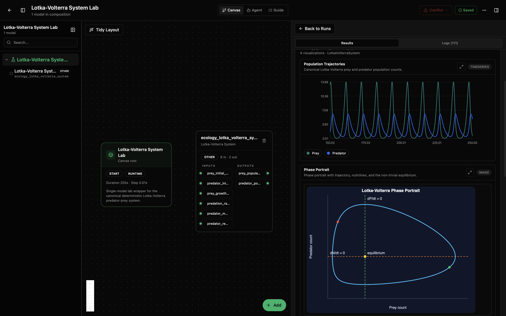
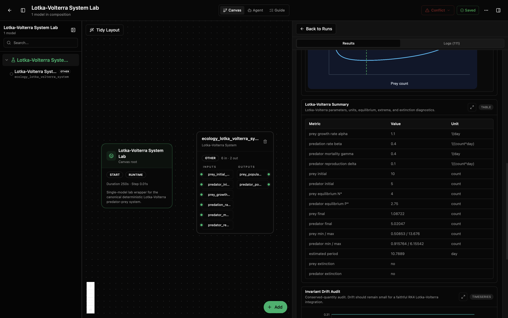

# Lotka-Volterra System Lab

This lab runs the classic predator-prey model: one population is the prey, the other is the predator. The model asks a simple question: if prey can reproduce on their own, predators decline without food, and predators meet prey at random, what happens over time?

The usual answer is a cycle. Prey rise first. More prey supports more predators. More predators then push prey down. With less food, predators fall too. Once predator pressure drops, prey recover, and the cycle starts again.

This is the plain Lotka-Volterra model. It is useful as a clean baseline, not as a complete field ecology model. It does not include carrying capacity, seasons, disease, migration, age classes, changing habitat, or food limits. Those belong in a richer model such as the Rosenzweig-MacArthur lab.

## What You'll See

The lab opens as a small canvas with one Lotka-Volterra model node and a run-results panel. The first screenshot shows the population trajectory and phase portrait. The second shows the parameter summary and invariant-drift audit used to check that the numerical integration stayed faithful to the classical model.





## How to Read the Visualizations

The population trajectory plot is the direct time view of the simulation. The x-axis is time in days and the y-axis is population count. In the classical Lotka-Volterra cycle, prey usually rise first because they grow without needing predators. Predator numbers then rise after a delay because reproduction depends on prey encounters. As predator pressure increases, prey decline; once prey are scarce, predators decline too.

The phase portrait shows the same run in state space instead of time. The x-axis is prey count and the y-axis is predator count. Each point on the curve is one simulated predator-prey state. A closed loop means the model is cycling around the non-zero equilibrium:

```text
prey equilibrium N* = gamma / delta
predator equilibrium P* = alpha / beta
```

The horizontal `dN/dt = 0` line marks where prey growth switches direction. The vertical `dP/dt = 0` line marks where predator growth switches direction. Their intersection is the equilibrium. The start marker shows the initial populations, and the end marker shows where the run finished.

The summary table gives the parameter values, equilibrium point, final populations, min/max ranges, estimated cycle period, and extinction checks. Use it to compare runs when you change initial populations or rates.

The invariant drift audit is a numerical quality check. The ideal Lotka-Volterra system conserves a quantity over time, so the drift from the initial value should stay small. Large or steadily growing drift usually means the integration step is too coarse for the chosen parameters, not that the ecological story changed.

## What This Lab Contains

- `lab.yaml` describes the lab and exposes its inputs and outputs.
- `wiring-layout.json` places the model on the canvas.
- `model/model.yaml` describes the model package, parameters, and ports.
- `model/src/lotka_volterra.py` contains the equations and visualizations.
- `model/tests/` checks the equations, outputs, and lab contract.

## Inputs

The ports use generic names so the lab can be reused with any predator-prey pair.

- `prey_initial_population` (`count`): starting prey population.
- `predator_initial_population` (`count`): starting predator population.
- `prey_growth_rate` (`1/day`): how fast prey grow when predators are absent.
- `predation_rate` (`1/(count*day)`): how strongly predator-prey encounters reduce prey.
- `predator_mortality_rate` (`1/day`): how fast predators decline without prey.
- `predator_reproduction_rate` (`1/(count*day)`): how prey encounters increase predators.

## Outputs

- `prey_population_state` (`count`): current prey count and timestamp.
- `predator_population_state` (`count`): current predator count and timestamp.

The run also produces useful views: population trajectories, a phase portrait, a parameter/equilibrium table, and an invariant-drift audit. The audit is there because this model has a conserved quantity; if the numerical method is behaving well, the drift should stay small.

## Recreate and Run with the Biosim CLI

From this lab folder:

```bash
cd /path/to/models-ecology/labs/ecology-lotka-volterra-system
mkdir -p dist
python -m biosim pack build . --out dist/lotka-volterra.bsilab
python -m biosim pack run dist/lotka-volterra.bsilab
```

If you are working from this monorepo without installing `biosim`, use the local package environment instead:

```bash
mkdir -p dist
/path/to/bsim-active/biosim/.venv/bin/python -m biosim pack build . --out dist/lotka-volterra.bsilab
/path/to/bsim-active/biosim/.venv/bin/python -m biosim pack run dist/lotka-volterra.bsilab
```

You can also validate the package before running:

```bash
python -m biosim pack validate dist/lotka-volterra.bsilab
```

## Run in the Desktop App

1. Open Biosimulant Desktop.
2. Go to Projects or Labs.
3. Choose the option to open or import an existing lab.
4. Select this folder's `lab.yaml`.
5. Open the lab and press Run.

The right side of the app should show the run result and the visualizations.

## How to Edit It

For small changes, edit `lab.yaml` or use the Desktop app's lab settings.

- Change `runtime.duration` to run for more or fewer days.
- Change `runtime.communication_step` to control how often the model reports output.
- Edit `model/model.yaml` to change default parameter values or descriptions.
- Edit `model/src/lotka_volterra.py` only if you are changing code.

Keep the equations in this lab as Lotka-Volterra:

```text
dN/dt = alpha*N - beta*N*P
dP/dt = delta*N*P - gamma*P
```

If you need carrying capacity, seasons, disease, migration, or patch structure, start from the Rosenzweig-MacArthur lab instead of adding those features here.
