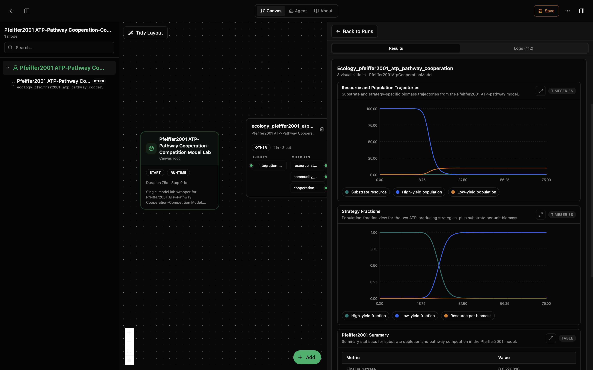
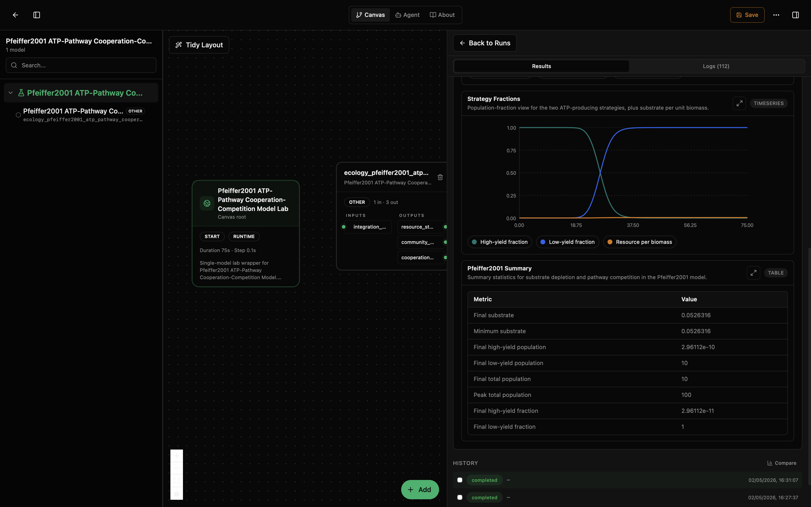

# Pfeiffer2001 ATP-Pathway Cooperation Lab

This lab runs a microbial metabolic competition model. It asks: when two populations use different ATP-producing strategies — one high-yield (oxidative phosphorylation) and one low-yield but fast (substrate-level phosphorylation) — which strategy wins and why?

The model tracks a shared substrate resource and two populations. The high-yield strategy (N1) produces more ATP per substrate molecule but grows more slowly. The low-yield strategy (N2) grows faster but wastes substrate. The outcome depends on the balance between metabolic efficiency and growth rate, which drives the classic cooperation-competition tradeoff in microbial ecology.

This model wraps the upstream SBML from Pfeiffer et al. (2001), published as [BioModels BIOMD0000000337](https://www.ebi.ac.uk/biomodels/BIOMD0000000337). The dynamics are solved by Tellurium from the original SBML file.

## What You'll See

The lab opens as a canvas with one model node and a run-results panel. After running, you will see three visualizations: resource and population trajectories, strategy-fraction time series, and a summary table. The first screenshot shows the canvas and results panel with the trajectory and strategy-fraction plots visible. The second scrolls down to focus on the strategy-fraction plot and the summary table for the same default run.





## How to Read the Visualizations

The trajectory plot shows three curves: the shared substrate resource (S), the high-yield population (N1), and the low-yield population (N2). As the populations grow, they deplete the substrate. In the default run shown above, the high-yield population collapses as the low-yield strategy expands, leaving a low-yield-dominated community after the substrate is nearly exhausted.

The strategy-fraction plot shows the proportion of total biomass belonging to each strategy, plus the resource-per-biomass ratio. If one strategy outcompetes the other, its fraction will approach 1.0 while the other approaches 0.0. In the screenshot, the low-yield fraction rises to 1.0 while the high-yield fraction falls to 0.0.

The summary table gives final and extremal values for substrate, population sizes, and strategy fractions. In the default screenshot, final substrate is about 0.0526, final low-yield population is 10, and the high-yield population is effectively zero.

## What This Lab Contains

- `lab.yaml` describes the lab and exposes its outputs.
- `wiring-layout.json` places the model on the canvas.
- `model/model.yaml` describes the model package, parameters, and ports.
- `model/src/pfeiffer2001_atp_cooperation.py` wraps the SBML model and computes ecology observables.
- `model/tests/` checks output accumulation, visual trajectories, and fraction conservation.
- `model/data/BIOMD0000000337.xml` is the original SBML file from BioModels.

## Inputs

Parameters are set through `model/model.yaml` init_kwargs. The `integration_step` parameter is also exposed as an input port for workflow wiring.

- `model_path` (`path`): relative path to the SBML file (default `data/BIOMD0000000337.xml`). This should not normally be changed.
- `integration_step` (`time`): numerical integration step size for the ODE solver (default 0.1). Also available as an input port. Smaller values give more precise output but take longer. The SBML model's internal parameters (rate constants, initial concentrations) are defined in the SBML file itself, not in init_kwargs.

## Outputs

- `resource_state` (`concentration`): shared substrate resource concentration (S).
- `community_state` (`population`): population sizes for the high-yield (N1) and low-yield (N2) strategies, plus total population.
- `cooperation_metrics` (`fraction`): high-yield fraction, low-yield fraction, and resource-per-biomass ratio.

## Recreate and Run with the Biosim CLI

From this lab folder:

```bash
cd /path/to/models-ecology/labs/ecology-pfeiffer2001-atp-pathway-cooperation
mkdir -p dist
python -m biosim pack build . --out dist/pfeiffer2001-atp-cooperation.bsilab
python -m biosim pack run dist/pfeiffer2001-atp-cooperation.bsilab
```

If you are working from this monorepo without installing `biosim`, use the local package environment instead:

```bash
mkdir -p dist
/path/to/bsim-active/biosim/.venv/bin/python -m biosim pack build . --out dist/pfeiffer2001-atp-cooperation.bsilab
/path/to/bsim-active/biosim/.venv/bin/python -m biosim pack run dist/pfeiffer2001-atp-cooperation.bsilab
```

You can also validate the package before running:

```bash
python -m biosim pack validate dist/pfeiffer2001-atp-cooperation.bsilab
```

## Run in the Desktop App

1. Open Biosimulant Desktop.
2. Go to Projects or Labs.
3. Choose the option to open or import an existing lab.
4. Select this folder's `lab.yaml`.
5. Open the lab and press Run.

The right side of the app should show the run result and the visualizations.

## How to Edit It

For scenario changes, start with `model/model.yaml` and `lab.yaml`.

- Change `runtime.duration` in `lab.yaml` for a longer or shorter simulation.
- Change `runtime.communication_step` if you want more or fewer reported points.
- Change `integration_step` in `model/model.yaml` for finer or coarser ODE integration.

To change the biological parameters (rate constants, initial concentrations, stoichiometry), edit the SBML file `model/data/BIOMD0000000337.xml` directly or replace it with a modified version.

Edit `model/src/pfeiffer2001_atp_cooperation.py` only if you are changing the observables, adding new output metrics, or modifying the visualization. If you only want a different scenario, prefer changing the SBML file rather than the Python code.
