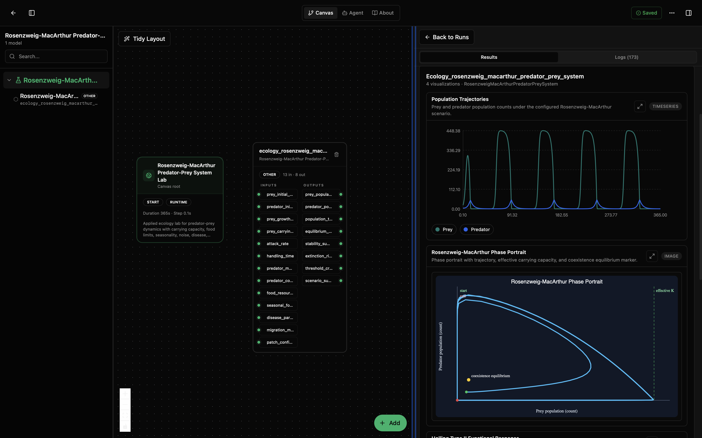
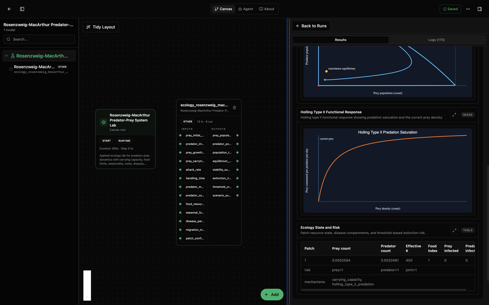

# Rosenzweig-MacArthur Predator-Prey System Lab

This lab is a more practical predator-prey model. It keeps the familiar prey-and-predator story, but adds the parts that make the system closer to real ecology: limited resources, carrying capacity, predator handling time, seasons, random environmental variation, disease, movement between patches, and optional stage structure.

A simple way to read it:

- Prey can grow, but they cannot grow forever because the habitat has a carrying capacity.
- Predators eat prey, but they cannot eat infinitely fast. Handling time makes predation saturate at high prey density.
- Predators turn some of what they eat into new predator population.
- Both populations can be affected by disease, seasonality, noise, and movement between patches.

This is still a model, not a field survey. Its job is to test scenarios, compare assumptions, and see which settings make a population stable, risky, or likely to collapse.

## Default Scenario

The lab opens with an intentionally unstable boom-bust scenario. Prey start low, predators start low, and the prey carrying capacity is high. That lets prey surge first. Predators then lag behind, grow quickly once prey are abundant, overexploit the prey population, and eventually crash because food becomes scarce.

This default is meant to make the value of the model visible in one run: the population trajectory should show delayed predator response, overshoot, collapse risk, and threshold warnings instead of a quiet equilibrium.

## What You'll See

The lab opens as a canvas with one Rosenzweig-MacArthur model node and a run-results panel. The first screenshot shows the full-run population trajectories and the phase portrait. The second shows the Holling type II functional response and the final ecology state/risk table.





## How to Read the Visualizations

The population trajectory plot is the time view of the simulation. The x-axis is time in days and the y-axis is population count. In the default boom-bust scenario, prey climb first because the habitat can support many more prey than the starting count. Predator growth follows after a delay. When predators become abundant, prey are pushed down hard; predators then crash because there is not enough food left. Repeated peaks show the lagged predator-prey feedback.

The phase portrait shows the same run in state space instead of time. The x-axis is prey count and the y-axis is predator count. Each point on the curve is one simulated ecosystem state. A large loop means the system is moving through boom-bust states rather than settling quietly. The green vertical line is the effective carrying capacity, the yellow marker is the coexistence equilibrium, the green marker is the start, and the red marker is the end.

The Holling type II functional response plot explains the predator feeding limit. The x-axis is prey density and the y-axis is prey consumed per predator per day. The orange curve rises when prey become more available, then flattens because predators are limited by handling time. The dashed blue line marks the current prey density. In the final state of the default run, that marker is far left because prey have collapsed.

The ecology state and risk table summarizes the final state. In the default run, both prey and predator counts are close to zero, effective carrying capacity remains high, and the risk row reports `prey=1`, `predator=1`, and `joint=1`. That means the scenario has crossed the model's extinction-risk thresholds. The mechanisms row shows which ecological mechanisms were active; by default, the demonstration uses carrying capacity and Holling type II predation without disease, seasonality, migration, or patch structure.

## Why This Is Not Just Lotka-Volterra

Lotka-Volterra is the clean teaching model. It assumes prey grow without a limit and predator-prey encounters follow a simple mass-action rule.

Rosenzweig-MacArthur adds two important ideas:

- prey growth slows as the habitat fills up;
- predation follows a Holling type II response, so predators become limited by handling time.

Those two changes make it much better for applied questions such as habitat quality, food shortage, seasonal pressure, and population risk.

## What This Lab Contains

- `lab.yaml` describes the lab and exposes the ports that other labs can wire into.
- `wiring-layout.json` places the model on the canvas.
- `model/model.yaml` describes the model package, defaults, units, and outputs.
- `model/src/rosenzweig_macarthur.py` contains the model and visuals.
- `model/tests/` checks carrying capacity, predation saturation, seasonality, noise, disease, migration, units, and visuals.

## Inputs

The main inputs are:

- `prey_initial_population` (`count`): starting prey population.
- `predator_initial_population` (`count`): starting predator population.
- `prey_growth_rate` (`1/day`): how fast prey grow in good conditions.
- `prey_carrying_capacity` (`count`): the habitat limit for prey.
- `attack_rate` (`1/(count*day)`): how quickly predators find prey.
- `handling_time` (`day`): time needed to handle one prey item.
- `predator_mortality_rate` (`1/day`): predator loss rate.
- `predator_conversion_efficiency` (`predator/prey`): how much predator population is gained from eaten prey.
- `food_resource_index` (`dimensionless`): resource quality multiplier.

Optional inputs can turn on or configure seasonal forcing, disease, migration, and patch settings.

## Outputs

- `prey_population_state` (`count`): current prey count, timestamp, and patch counts.
- `predator_population_state` (`count`): current predator count, timestamp, and patch counts.
- `population_timeseries` (`count`): trajectory over time.
- `equilibrium_summary` (`count`): rough coexistence equilibrium information.
- `stability_summary` (`dimensionless`): plain-language stability classification.
- `extinction_risk` (`fraction`): recent threshold-based risk scores.
- `threshold_crossings` (`dimensionless`): records when prey or predators cross risk thresholds.
- `scenario_summary`: enabled mechanisms, labels, and units.

The visualizations are specific to this model: full-run population trajectories, a phase portrait with effective carrying capacity, a Holling type II predation curve, and a patch/resource/risk table.

## Recreate and Run with the Biosim CLI

From this lab folder:

```bash
cd /path/to/models-ecology/labs/ecology-rosenzweig-macarthur-predator-prey-system
mkdir -p dist
python -m biosim pack build . --out dist/rosenzweig-macarthur.bsilab
python -m biosim pack run dist/rosenzweig-macarthur.bsilab
```

If you are using the local monorepo environment:

```bash
mkdir -p dist
/path/to/bsim-active/biosim/.venv/bin/python -m biosim pack build . --out dist/rosenzweig-macarthur.bsilab
/path/to/bsim-active/biosim/.venv/bin/python -m biosim pack run dist/rosenzweig-macarthur.bsilab
```

You can validate the package first:

```bash
python -m biosim pack validate dist/rosenzweig-macarthur.bsilab
```

## Run in the Desktop App

1. Open Biosimulant Desktop.
2. Go to Projects or Labs.
3. Choose the option to open or import an existing lab.
4. Select this folder's `lab.yaml`.
5. Open the lab and press Run.

After the run, check the plots and the risk table. The phase portrait is useful for seeing the relationship between prey and predator counts. The Holling curve shows when predators are becoming limited by handling time instead of prey availability.

## How to Edit It

For scenario changes, start with `model/model.yaml` and `lab.yaml`.

- Change `runtime.duration` in `lab.yaml` for a longer or shorter run.
- Change `runtime.communication_step` if you want more or fewer reported points.
- Change defaults in `model/model.yaml` for carrying capacity, attack rate, handling time, mortality, or food resource index.
- Use `patch_count`, patch initial populations, and migration settings for spatial scenarios.
- Use disease settings when you want infected/susceptible compartments to matter.

If you are using the Desktop app, you can edit the lab through the canvas and properties panels, then save the lab back to disk.

Edit `model/src/rosenzweig_macarthur.py` only when you need to change the actual model behavior. Good code-level edits include adding a new risk metric, changing a disease assumption, or adding a new visualization. If you only want a different scenario, prefer changing parameters rather than changing the Python code.
