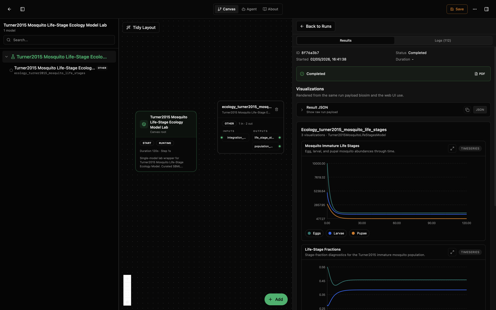
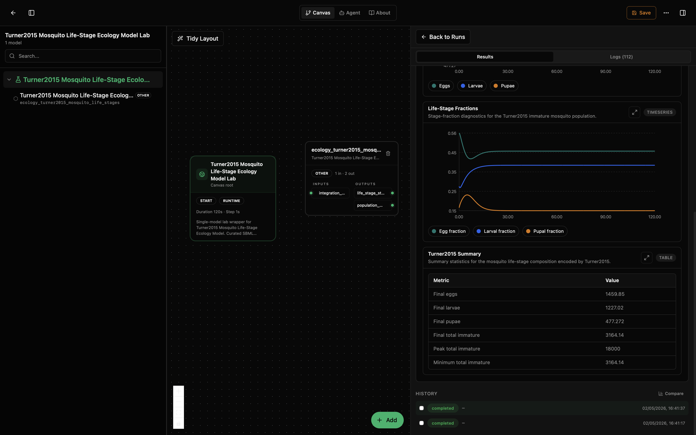

# Turner2015 Mosquito Life-Stages Lab

This lab runs a mosquito immature life-stage model. It asks: how do egg, larval, and pupal populations change over time, and what is the stage composition of the immature mosquito population?

The model tracks three immature life stages — eggs, larvae, and pupae — using ODE dynamics from the original SBML. Each stage has characteristic development and mortality rates that determine how individuals flow through the life cycle. The stage-fraction diagnostics show whether the population is egg-heavy, larval-heavy, or balanced.

This model wraps the upstream SBML from Turner et al. (2015), published as [BioModels BIOMD0000000922](https://www.ebi.ac.uk/biomodels/BIOMD0000000922). The dynamics are solved by Tellurium from the original SBML file.

## What You'll See

The lab opens as a canvas with one model node and a run-results panel. After running, you will see three visualizations: life-stage abundance trajectories, stage-fraction time series, and a summary table. The first screenshot shows the canvas and results panel with the immature life-stage trajectories and stage-fraction plot visible. The second scrolls down to focus on the stage-fraction plot and the summary table for the same run.





## How to Read the Visualizations

The life-stage plot shows three curves: eggs, larvae, and pupae over time (days). The x-axis is time in days and the y-axis is population count. In a typical run, you will see the populations fall from their initial transient and then approach a stable immature-stage composition as development rates balance mortality.

The stage-fraction plot shows the proportion of total immature population in each stage. These fractions always sum to 1.0. If one stage dominates, its fraction will be close to 1.0. In the screenshot, the system settles into an egg-heavy composition, with eggs around 46%, larvae around 39%, and pupae around 15% of the immature population.

The summary table gives final and extremal values for each life stage and the total immature population. In the shown run, the final immature population is about 3164 individuals, split across roughly 1460 eggs, 1227 larvae, and 477 pupae.

## What This Lab Contains

- `lab.yaml` describes the lab and exposes its outputs.
- `wiring-layout.json` places the model on the canvas.
- `model/model.yaml` describes the model package, parameters, and ports.
- `model/src/turner2015_mosquito_life_stages.py` wraps the SBML model and computes life-stage observables.
- `model/tests/` checks output accumulation, visual trajectories, and stage-fraction conservation.
- `model/data/BIOMD0000000922.xml` is the original SBML file from BioModels.

## Inputs

Parameters are set through `model/model.yaml` init_kwargs. The `integration_step` parameter is also exposed as an input port for workflow wiring.

- `model_path` (`path`): relative path to the SBML file (default `data/BIOMD0000000922.xml`). This should not normally be changed.
- `integration_step` (`day`): numerical integration step size for the ODE solver (default 0.1). Also available as an input port. Smaller values give more precise output but take longer. The SBML model's internal parameters (development rates, mortality rates, initial populations) are defined in the SBML file itself, not in init_kwargs.

## Outputs

- `life_stage_state` (`individuals`): egg, larval, and pupal abundances, plus total immature population.
- `population_metrics` (`fraction`): egg fraction, larval fraction, pupal fraction, and total immature population.

## Recreate and Run with the Biosim CLI

From this lab folder:

```bash
cd /path/to/models-ecology/labs/ecology-turner2015-mosquito-life-stages
mkdir -p dist
python -m biosim pack build . --out dist/turner2015-mosquito-life-stages.bsilab
python -m biosim pack run dist/turner2015-mosquito-life-stages.bsilab
```

If you are working from this monorepo without installing `biosim`, use the local package environment instead:

```bash
mkdir -p dist
/path/to/bsim-active/biosim/.venv/bin/python -m biosim pack build . --out dist/turner2015-mosquito-life-stages.bsilab
/path/to/bsim-active/biosim/.venv/bin/python -m biosim pack run dist/turner2015-mosquito-life-stages.bsilab
```

You can also validate the package before running:

```bash
python -m biosim pack validate dist/turner2015-mosquito-life-stages.bsilab
```

## Run in the Desktop App

1. Open Biosimulant Desktop.
2. Go to Projects or Labs.
3. Choose the option to open or import an existing lab.
4. Select this folder's `lab.yaml`.
5. Open the lab and press Run.

The right side of the app should show the run result and the visualizations.

## How to Edit It

For scenario changes, start with `model/model.yaml` and `lab.yaml`.

- Change `runtime.duration` in `lab.yaml` for a longer or shorter simulation (default is 365 days).
- Change `runtime.communication_step` if you want more or fewer reported points.
- Change `integration_step` in `model/model.yaml` for finer or coarser ODE integration.

To change the biological parameters (development rates, mortality rates, initial populations), edit the SBML file `model/data/BIOMD0000000922.xml` directly or replace it with a modified version.

Edit `model/src/turner2015_mosquito_life_stages.py` only if you are changing the observables, adding new output metrics (e.g., adult stages), or modifying the visualization. If you only want a different scenario, prefer changing the SBML file rather than the Python code.
